# 🚀 Week 02 - Express CRUD Task Management API


## 📖 Project Overview

This project was developed as part of the **FlyRank Backend AI Engineering Internship – Week 02 Assignment**.

The objective of this assignment was to build a **RESTful Task Management API** using **Node.js** and **Express.js** while following backend development best practices.

During this assignment, the following features were implemented:

- 🔹 Built a RESTful API using Express.js
- 🔹 Implemented complete CRUD (Create, Read, Update, Delete) operations
- 🔹 Added request body validation for POST and PUT endpoints
- 🔹 Implemented proper HTTP status codes (200, 201, 400, 404)
- 🔹 Returned consistent JSON responses for every endpoint
- 🔹 Added error handling for invalid requests and missing resources
- 🔹 Integrated Swagger UI using an OpenAPI 3.0 specification
- 🔹 Documented all API endpoints with request and response examples
- 🔹 Captured API testing screenshots using Postman
- 🔹 Organized the project with clean folder structure and documentation

This project demonstrates the fundamentals of backend API development, REST architecture, API documentation, request validation, and clean Express.js application structure.

---

# ✨ Features

- ✅ RESTful API using Express.js
- ✅ CRUD Operations
- ✅ In-Memory Task Storage
- ✅ Request Validation
- ✅ Proper HTTP Status Codes
- ✅ JSON Responses
- ✅ Error Handling
- ✅ Swagger API Documentation
- ✅ Clean Project Structure

---

# 🛠️ Tech Stack

- Node.js
- Express.js
- Swagger UI Express
- OpenAPI 3.0
- JavaScript

---

# 📂 Project Structure

```text
week-02/
│
├── screenshot/
│   ├── home-endpoint.png
│   ├── health-endpoint.png
│   ├── swagger-overview.png
│   ├── swagger-endpoints.png
│   ├── get-all-tasks.png
│   ├── get-task-by-id.png
│   ├── create-task-request.png
│   ├── create-task-response.png
│   ├── get-all-tasks-after-create.png
│   ├── update-task.png
│   ├── delete-task.png
│   ├── validation-error.png
│   └── task-not-found.png
│
├── server.js
├── README.md
│
├── openapi.json
├── package.json
└── package-lock.json
```

---

# ⚙️ Installation

## Clone Repository

```bash
git clone https://github.com/mukim-shah/flyrank-backend-ai-internship.git
```

Move into project

```bash
cd flyrank-backend-ai-internship
```

Install dependencies

```bash
npm install
```

Run the application

```bash
npm start
```

---

# 🌐 Server

```
http://localhost:3000
```

---

# 📄 Swagger Documentation

```
http://localhost:3000/docs
```

---

# 📡 API Endpoints

| Method | Endpoint | Description |
|---------|----------|-------------|
| GET | `/` | Root Endpoint |
| GET | `/health` | Health Check |
| GET | `/tasks` | Get All Tasks |
| GET | `/tasks/:id` | Get Task By ID |
| POST | `/tasks` | Create New Task |
| PUT | `/tasks/:id` | Update Existing Task |
| DELETE | `/tasks/:id` | Delete Task |
| GET | `/docs` | Swagger Documentation |

---

# 🧪 Sample Request

## Create Task

```http
POST /tasks
```

```json
{
  "title": "Complete FlyRank Assignment",
  "done": false
}
```

---

# ✅ Success Response

```json
{
  "success": true,
  "message": "Task created successfully.",
  "task": {
    "id": 6,
    "title": "Complete FlyRank Assignment",
    "done": false
  }
}
```

---

# ❌ Validation Error

**Status Code**

```
400 Bad Request
```

```json
{
  "success": false,
  "message": "Title and done fields are required."
}
```

---

# ❌ Resource Not Found

**Status Code**

```
404 Not Found
```

```json
{
  "success": false,
  "message": "Task not found"
}
```

---

# 📸 Project Screenshots

## 🏠 Home Endpoint

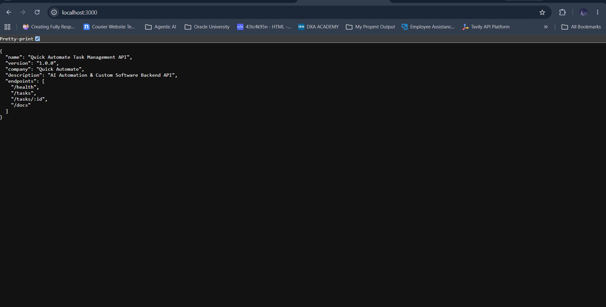

---

## ❤️ Health Endpoint

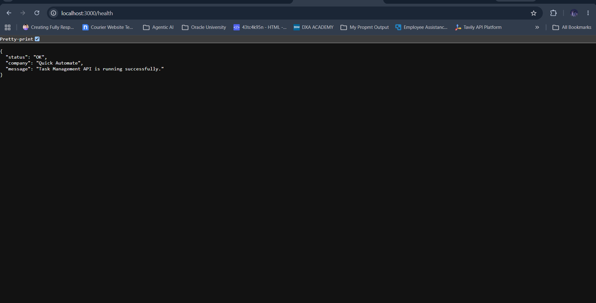

---

## 📚 Swagger Documentation

### Swagger Overview

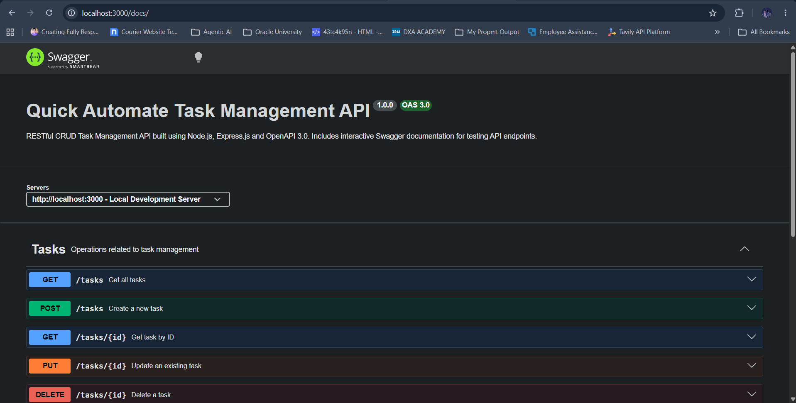

### Swagger Endpoints

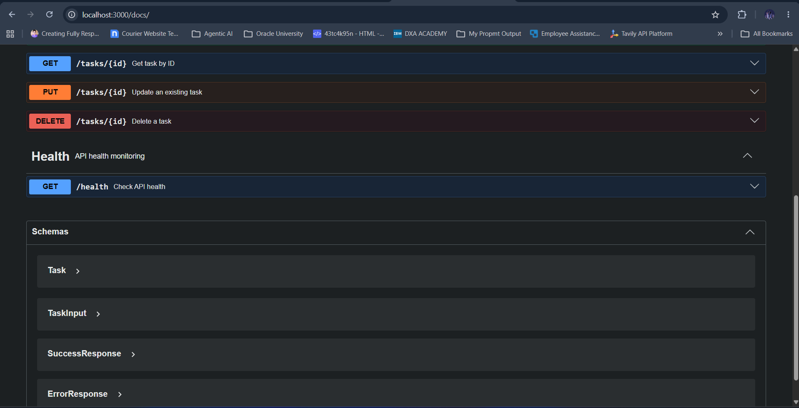

---

## 📋 Get All Tasks

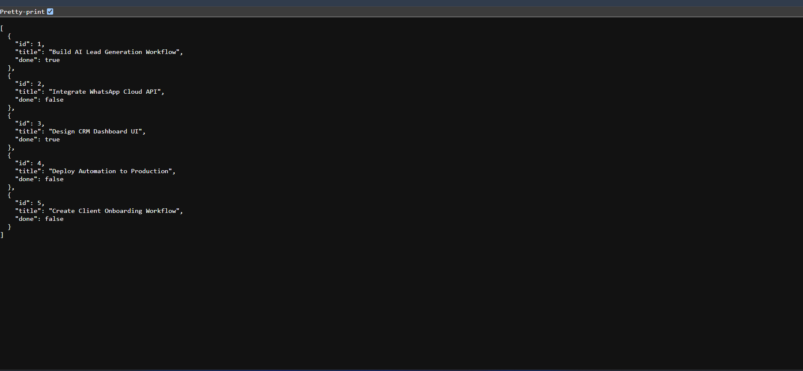

---

## 🔍 Get Task By ID

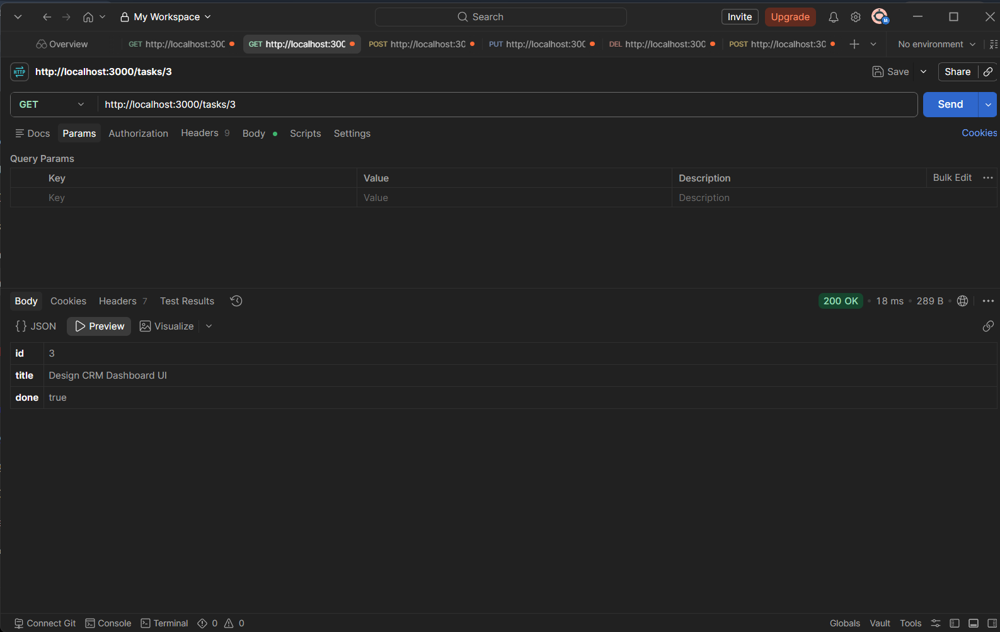

---

## ➕ Create Task Request

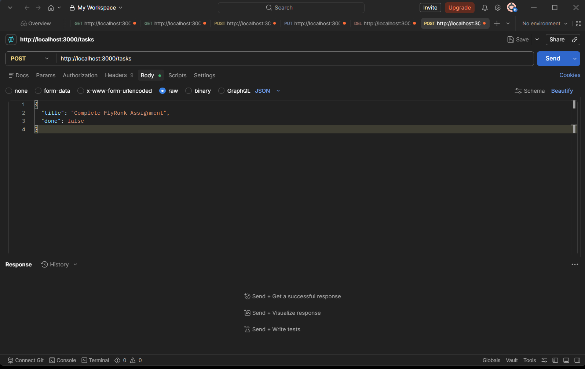

### Create Task Response

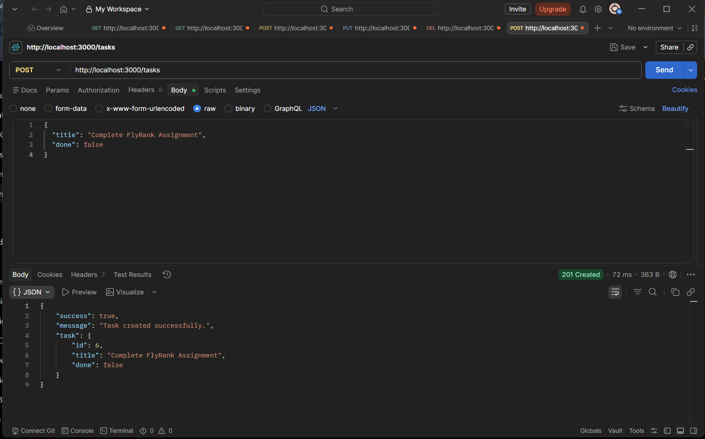

---

## 📄 Get Tasks After Create

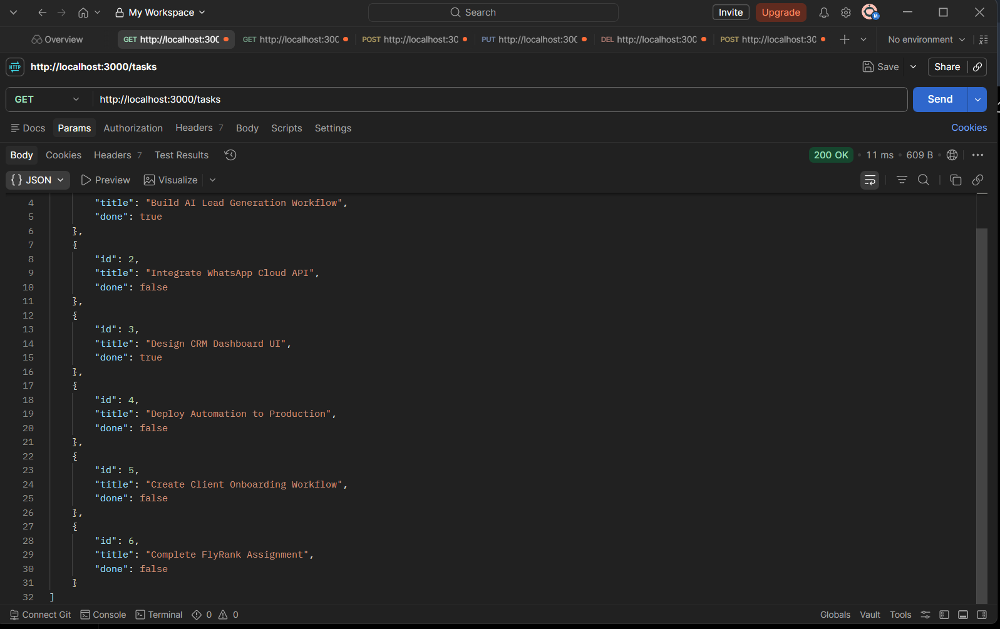

---

## ✏️ Update Task

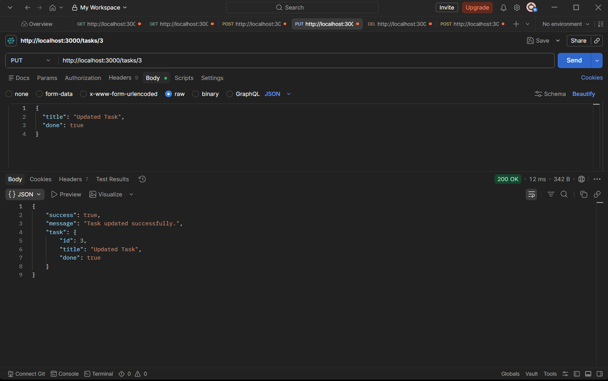

---

## 🗑️ Delete Task

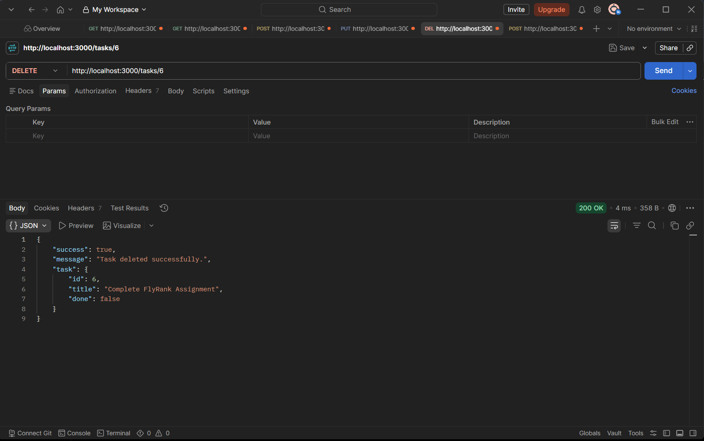

---

## ⚠️ Validation Error

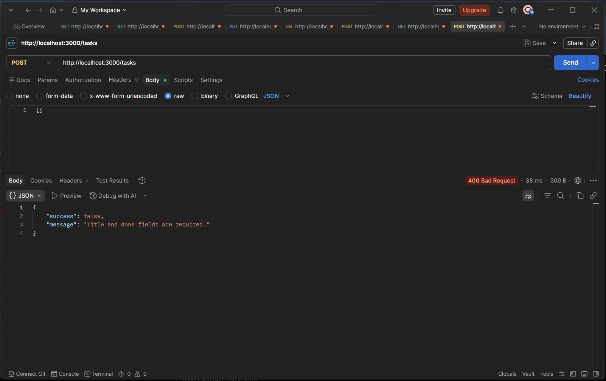

---

## ❌ Task Not Found

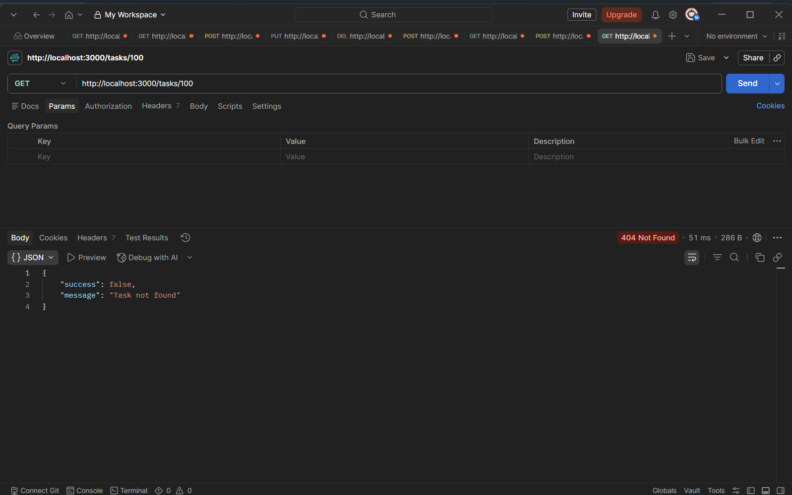

---

# 🎯 Learning Outcomes

During this assignment I learned:

- Building REST APIs using Express.js
- Implementing CRUD Operations
- Working with Request Validation
- Handling HTTP Status Codes
- API Error Handling
- Creating OpenAPI Documentation
- Integrating Swagger UI
- Writing Clean Backend Code
- Organizing Node.js Projects

---

# 👨‍💻 Author

**Mukim Shah**

Backend AI Engineering Intern

GitHub: https://github.com/mukim-shah

---

# ⭐ Assignment

**FlyRank Backend AI Engineering Internship**

**Week 02 – Express CRUD Task Management API**