# 🚀 Week 03 – Express CRUD API with SQLite Database


---

# 📖 Project Overview

This project was developed as part of the **FlyRank Backend AI Engineering Internship – Week 03 Assignment**.

The objective of this assignment was to replace the in-memory task storage from Week 02 with a **persistent SQLite database** using **better-sqlite3** while maintaining a complete RESTful CRUD API.

The application automatically creates the database and table on first run and inserts sample tasks only when the database is empty.

---

# ✨ Features

- ✅ SQLite Database Integration
- ✅ Persistent Data Storage
- ✅ Automatic Database Creation
- ✅ Automatic Table Creation
- ✅ Seed Initial Data
- ✅ Complete CRUD Operations
- ✅ Prepared SQL Statements
- ✅ Express Router Architecture
- ✅ SQL Query Testing using DB Browser for SQLite

---

# 🛠️ Tech Stack

- Node.js
- Express.js
- SQLite
- better-sqlite3
- JavaScript
- Postman
- DB Browser for SQLite

---

# 📂 Project Structure

```text
week-03/
│
├── screenshot/
│   ├── 01-project-running.png
│   ├── 02-get-all-tasks-api.png
│   ├── 03-post-create-task.png
│   ├── 04-put-update-task.png
│   ├── 05-delete-task.png
│   ├── 06-get-after-delete.png
│   ├── 07-database-structure.png
│   ├── 08-browse-tasks-table.png
│   ├── 09-all-tasks-query.png
│   ├── 10-count-query.png
│   ├── 11-completed-tasks-query.png
│   ├── 12-updated-tasks-query.png
│   ├── 13-deleted-tasks-query.png
|   └── 14-Output-Of-Browser.png
│
├── database.js
├── routes.js
├── server.js
├── tasks.db
└── README.md
```

---

# 🚀 Running the Project

## Option 1 – Run Week 03 Independently

```bash
npm install
npm run week3
```

Application

```text
http://localhost:3000/tasks
```

---

## Option 2 – Run as Part of the Multi-Week Project

From the project root

```bash
npm install
npm start
```

Application

```text
http://localhost:3000/week-03/tasks
```

---

# 📡 API Endpoints

| Method | Endpoint | Description |
|---------|----------|-------------|
| GET | `/tasks` | Get All Tasks |
| GET | `/tasks/:id` | Get Task By ID |
| POST | `/tasks` | Create New Task |
| PUT | `/tasks/:id` | Update Existing Task |
| DELETE | `/tasks/:id` | Delete Task |

> **Note:**  
> When running as part of the multi-week architecture, all endpoints are automatically prefixed with:

```text
/week-03
```

Example

```text
GET /week-03/tasks
POST /week-03/tasks
PUT /week-03/tasks/1
DELETE /week-03/tasks/1
```

---

# 🧪 Sample Request

## Create Task

```http
POST /tasks
```

```json
{
  "title": "Learn Node.js",
  "completed": 0
}
```

---

# ✅ Success Response

```json
{
  "id": 4,
  "title": "Learn Node.js",
  "completed": 0
}
```

---

# ❌ Resource Not Found

**404 Not Found**

```json
{
  "message": "Task not found"
}
```

---

# 📸 Project Screenshots

## 🚀 Server Running

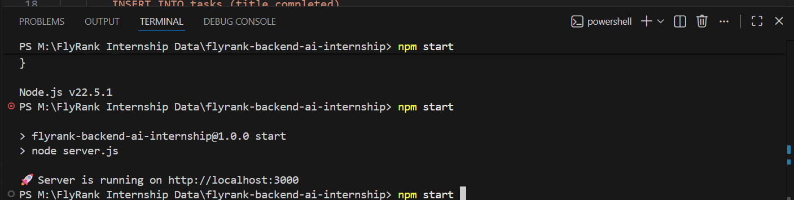

---

## 📋 GET All Tasks

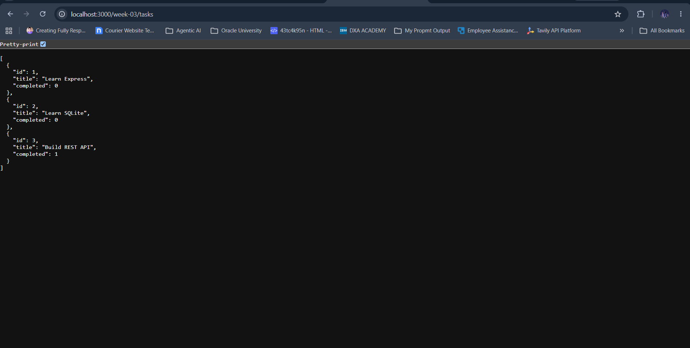

---

## ➕ POST Create Task

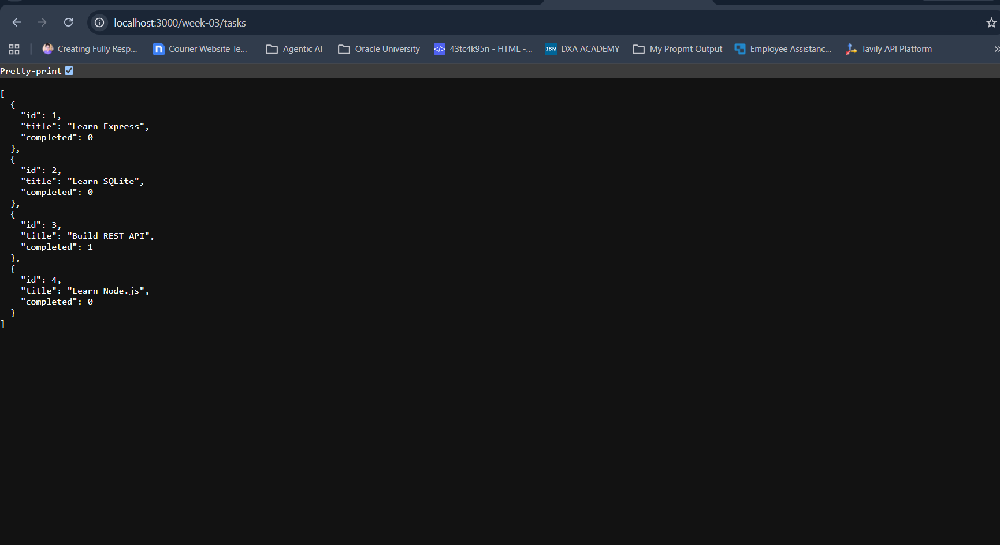

---

## ✏️ PUT Update Task

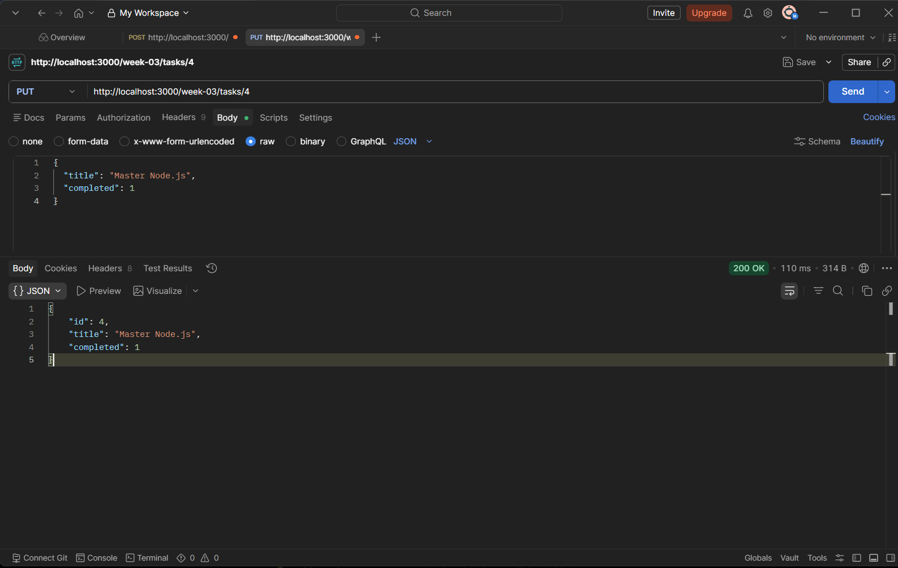

---

## 🗑️ DELETE Task

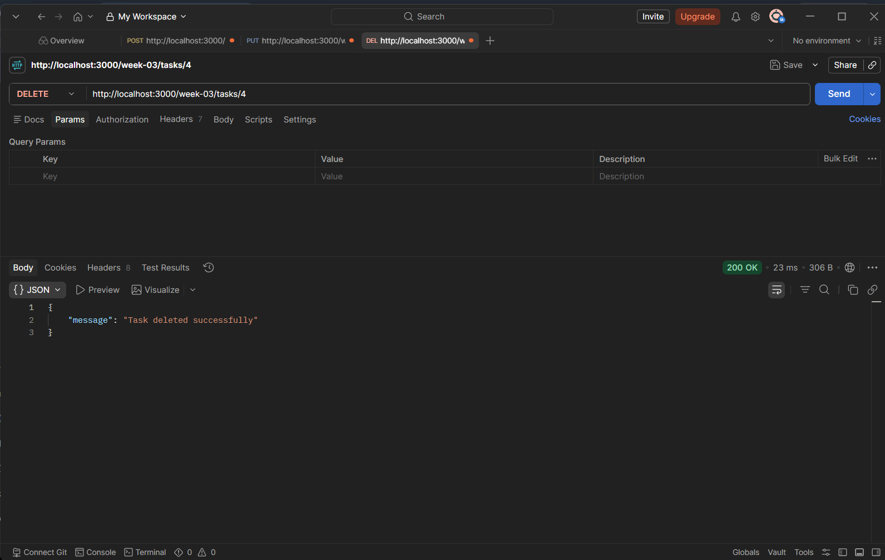

---

## 📄 GET After Delete


---

## 🗄️ SQLite Database Structure

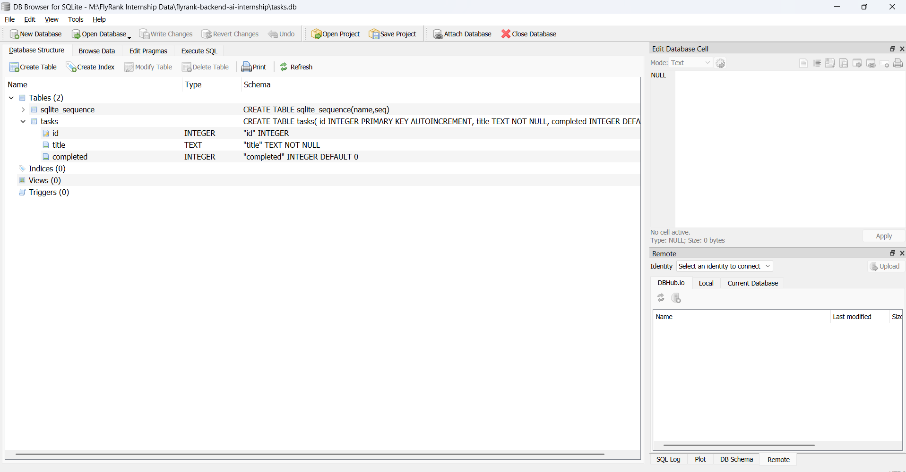

---

## 📊 Browse Tasks Table

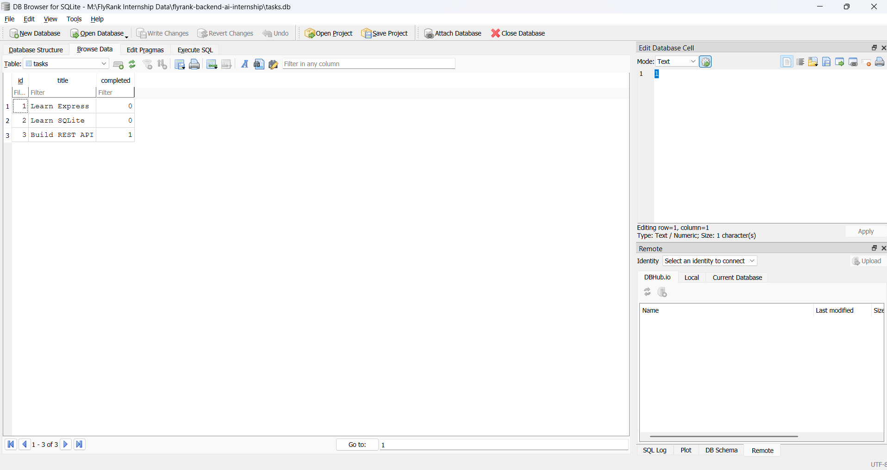

---

## 🔍 SQL Query – All Tasks


---

## 🔢 SQL Query – Count Tasks

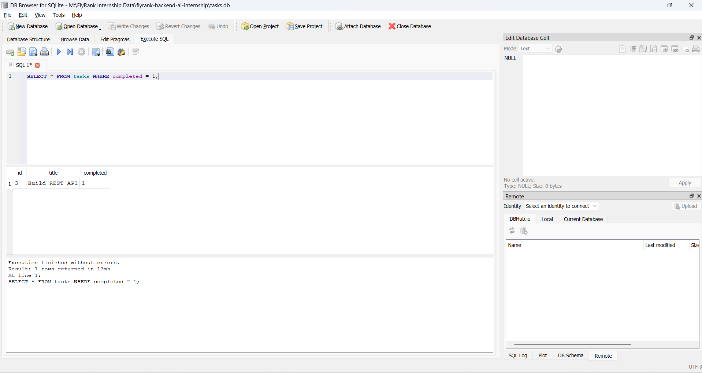

---

## ✅ SQL Query – Completed Tasks

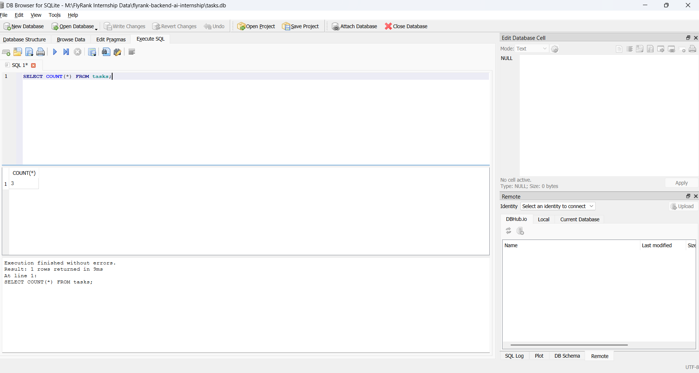

---

## ✏️ SQL Query – Updated Tasks

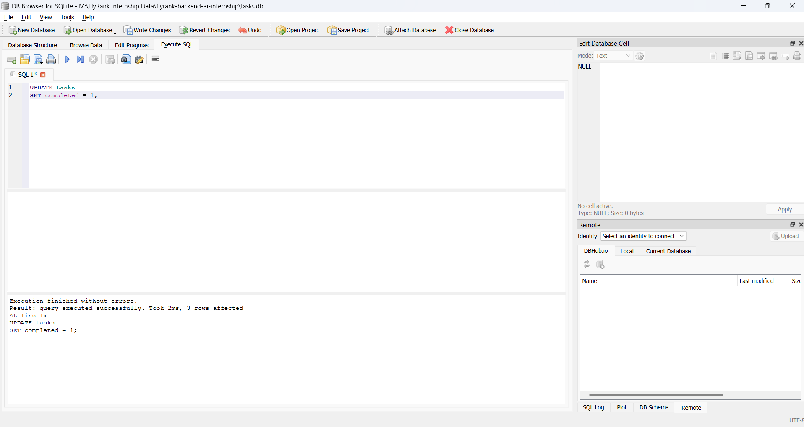

---

## 🗑️ SQL Query – Deleted Tasks

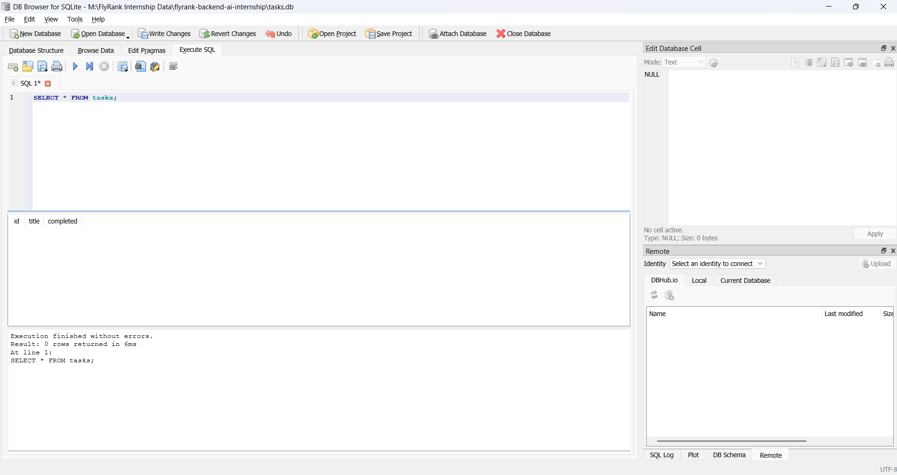

---

## 🗑️ Browser Ouput 

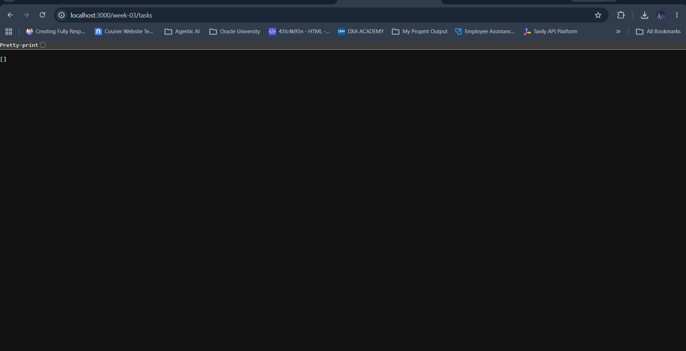

---

# 📝 Notes

- **server.js** is the standalone version of the Week 03 assignment.
- **routes.js** exports an Express Router and is used when combining multiple internship weeks into a single Express application.
- **database.js** manages the SQLite connection, creates the database automatically, creates the tasks table if it does not exist, and seeds initial data only when the table is empty.
- SQLite provides persistent storage, so data remains available after restarting the server.

---

# 🎯 Learning Outcomes

During this assignment I learned:

- Integrating SQLite with Express.js
- Using better-sqlite3
- Creating databases programmatically
- Creating tables automatically
- Seeding initial data
- Writing SQL queries
- Using Prepared Statements
- Building Persistent CRUD APIs
- Testing SQL Queries using DB Browser for SQLite
- Organizing Modular Express Applications

---

# 👨‍💻 Author

**Mukim Shah**

Backend AI Engineering Intern – FlyRank AI

GitHub: https://github.com/mukim-shah

---

# ⭐ Assignment

**FlyRank Backend AI Engineering Internship**

**Week 03 – Express CRUD API with SQLite Database**